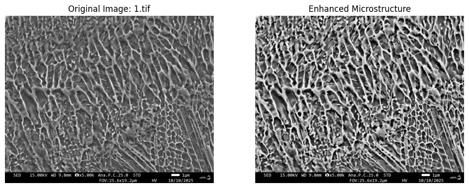

## 📊 Current Results
### Image Enhancement (CLAHE)
We successfully implemented a preprocessing pipeline to enhance the contrast of H13 Tool Steel micrographs. This allows for better segmentation of cellular dendrites.

